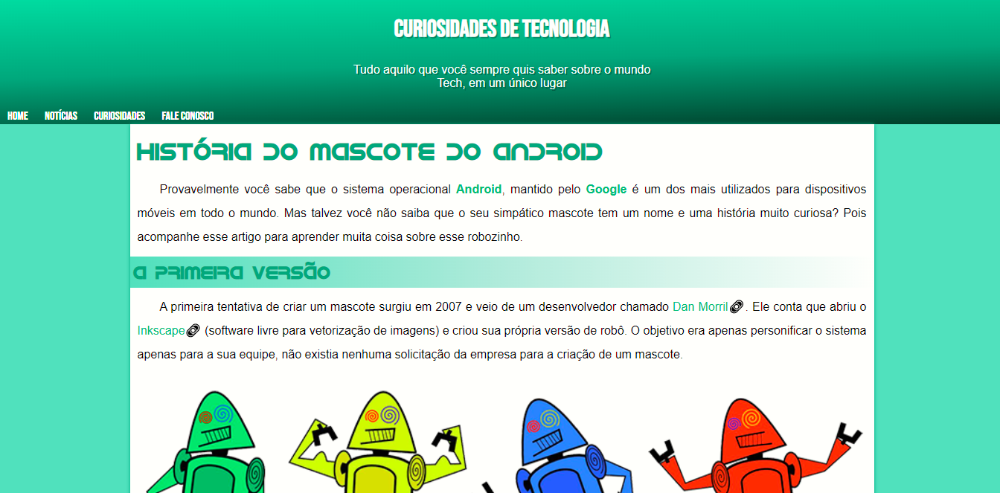

# Mascote do Android

Artigo promovido por Curso Em Vídeo para ensino de tecnologias WEB.

## 🛠 Tecnologias

- HTML
- CSS
- Git e Github

## 💻 Projeto

Esse artigo mostra de forma resumida como o Mascote do Android surgiu.

## ❤️ Contato

@arielrodrigues460